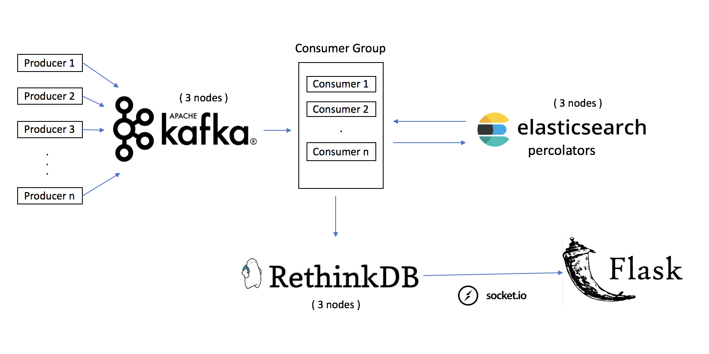

# StreamSearch: Insight Data Engineering Project

## Summary
Low Latency search of high velocity incoming data

## Motivation
To create a scalable architecture to process huge volumes of incoming data streams and provide search results are quickly as possible.

## Use Case

An ideal use case for this kind of problem is Amazon Customer Service portal. On one side we have Amazon customers who are facing problems, On the other end, we have Amazon customer service agents attending to customers. Now, Amazon based on what the customer says has to quickly divert its calls to the right customer service agent. Assuming speech to text is accurate, the application need to quickly search the term without havign the customer to wait.

For example, if a customer calls saying - "Hello, my device is malfunctioning, I need a refund". The application needs to search the word refund in the message log.       

## Pipeline

The Kafka producers are customers calling Amazon Customer service about their issues. These producers are generating messages with keywords like “Refund”, “Gift Card” randomly introduced in them. Then we have 3 nodes of Kafka servers/brokers ingesting the customer calls. Kafka consumers process the customer calls. 

Consumer then makes a request to the ElasticSearch cluster. I’m using ElasticSearch percolators to tell me which search queries exist in the customer call log. Percolators basically implements inverse index search and it is highly optimal for search data streams. 

Once, I know which word exists in the call log, it is inserted in respective buckets(tables) in RethinkDB. I'm using RethinkDB, because it emits a trigger event every time the data changes. This helps me update the data in real time on the UI using Websockets. The UI was implemented using Flask-Bootstrap

## Challenges
a) Scaling the Kafka Consumer, as it does most of the processing in the application. 

The project slides can be viewed [here](https://bit.ly/StreamSearchSlides).

The deno can be viewed [here](https://bit.ly/StreamSearch).